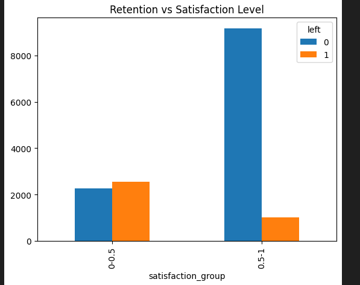
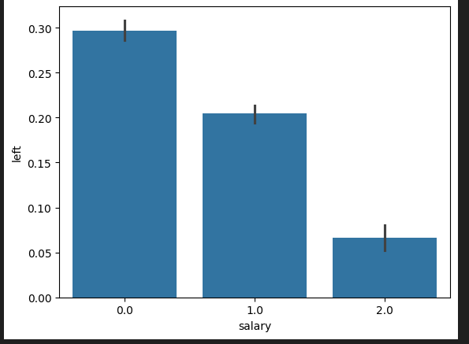
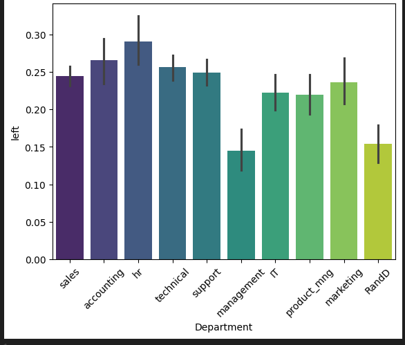

# 📊 Employee Retention Analysis & Prediction

This project focuses on analyzing employee data to understand the key factors influencing employee retention and predicting whether an employee will leave the company using Logistic Regression.

---

## 🚀 Project Overview

Employee attrition is a critical problem for organizations. In this project:

- Performed **Exploratory Data Analysis (EDA)**  
- Visualized relationships between variables and attrition  
- Built a **Logistic Regression model**  
- Implemented **manual single-feature logistic regression**  
- Evaluated model using accuracy  

---

## 📁 Dataset

- Source: HR Analytics Dataset (Kaggle)  
- Target Variable: `left` (0 = stay, 1 = leave)

---

## 🔍 Exploratory Data Analysis (EDA)

### 📉 Satisfaction Level vs Attrition



👉 Employees with low satisfaction are more likely to leave.

---

### 💰 Salary vs Retention



👉 Low salary employees have higher attrition rate.

---

### 🏢 Department vs Retention



👉 Some departments show higher employee turnover.

---

## 📊 Visualizations

All visualizations were created using **Matplotlib / Seaborn**.

---

## 🤖 Model Building

### Logistic Regression

- Used important feature(s) identified from EDA  
- Implemented using:
  - `sklearn`
  - Manual calculation  

### 🧠 Manual Logistic Regression

```python
z = intercept + weight * feature
probability = 1 / (1 + exp(-z))
